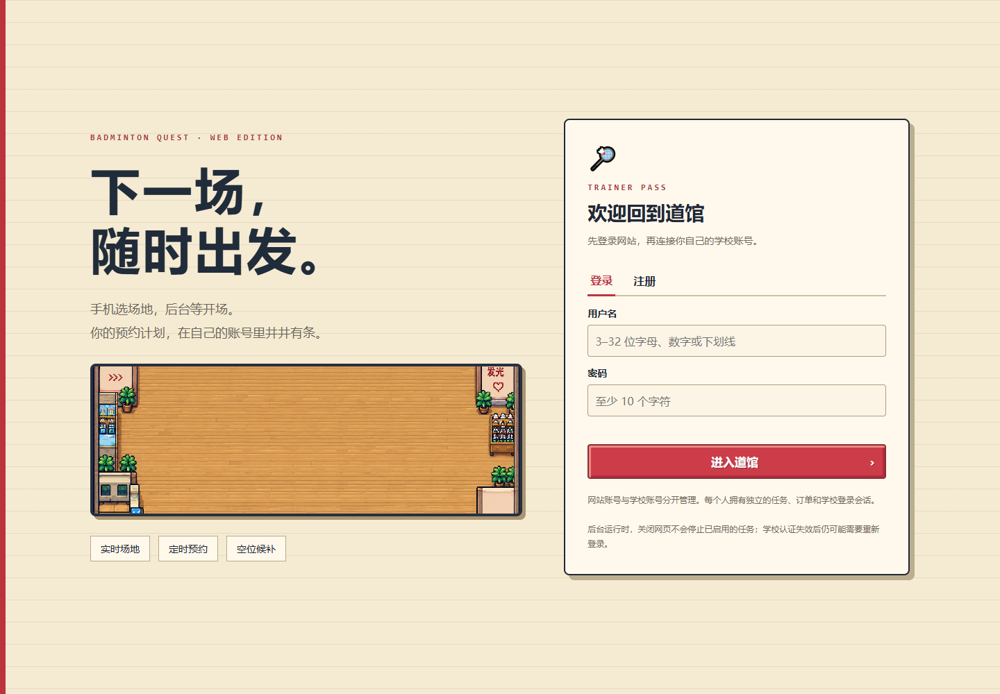
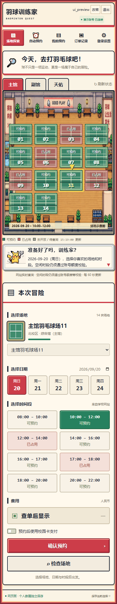
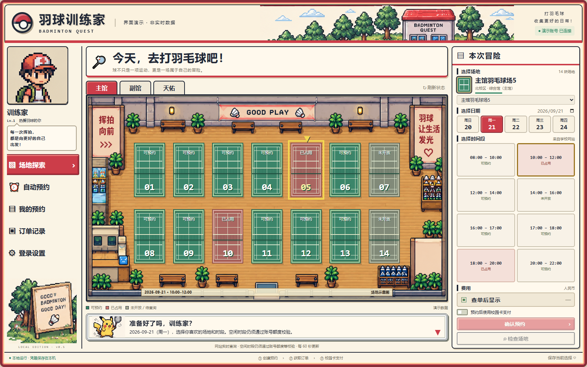
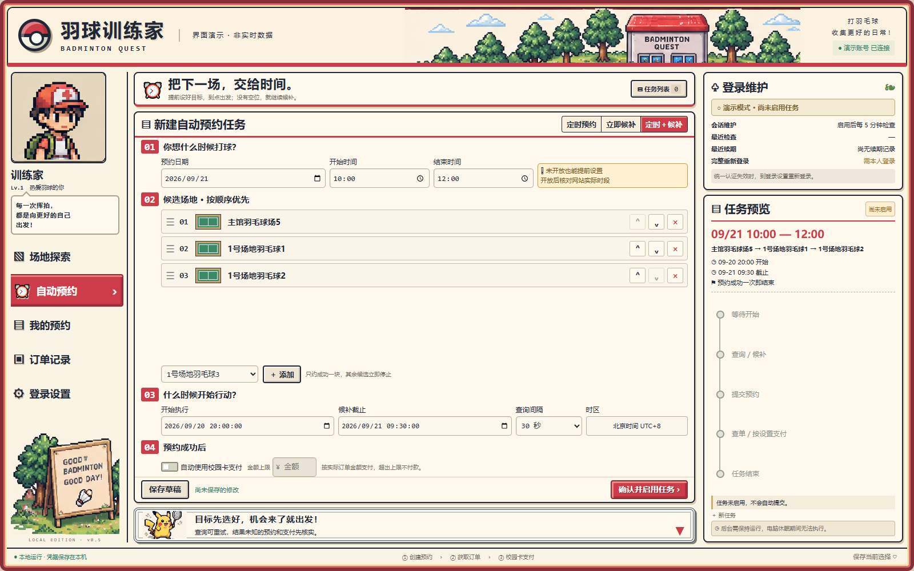
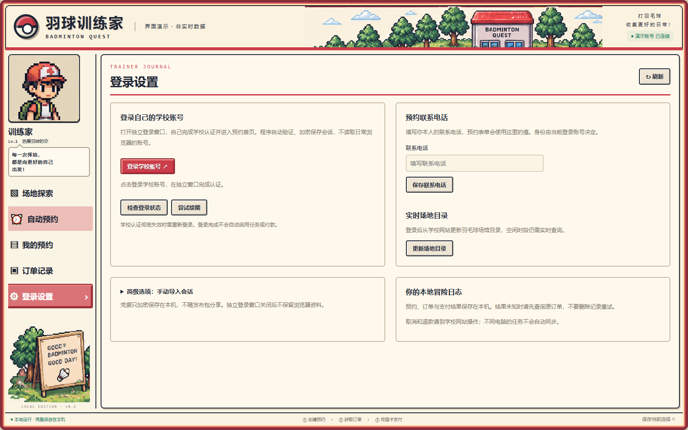

# 羽球训练家 · Badminton Quest

Python 羽毛球预约工具与像素风仪表盘。支持实时场地查询、学校账号登录、定时预约、候补和订单查询，提供可选的校园卡支付流程。

当前版本为 **0.8.0**：新增可部署到服务器的**多人网页版**，保留 Windows / macOS 本地单用户版。网页版支持独立账号、个人学校会话、任务和订单，电脑与手机浏览器均可访问。微信小程序尚未实现。

## 网页版

部署到 Railway：按 **[Railway 配置步骤](docs/RAILWAY.md)** 连接本仓库，挂载 `/data` 并生成域名。免费额度与学校登录兼容性需要实际验证。

本机预览，在仓库根目录运行：

```sh
python start_web.py
```

也可以双击 `Start-Web-Windows.bat`，或在 Mac 执行 `zsh Start-Web-macOS.command`。打开 `http://127.0.0.1:18880`，用 `.quest-data/invite-code.txt` 中的邀请码注册自己的账号，再进入「登录设置」绑定自己的学校账号。

服务器部署提供 Docker Compose、HTTPS 反向代理配置及持久化数据卷。部署步骤、账号隔离、备份方式和已验证范围见 **[网页版部署说明](docs/WEB_DEPLOYMENT.md)**。当前代码不附带公开运行中的网站；真实服务器学校登录需在部署环境验证。



<details><summary>手机端场地探索预览（演示数据）</summary>



</details>

## 界面预览

以下为程序实际界面截图，使用演示数据，不代表实时场地状态；不包含真实用户资料。

### 场地探索

按场馆、日期和时段查看场地状态，区分可预约、已占用和未开放。



### 定时预约与候补

提前设置时间和候选场地顺序，查看任务预览与会话维护状态。



### 登录设置

独立学校账号登录、会话检查和预约联系电话设置。



## 本地单用户版启动

安装 Python 3.10+（推荐 3.12），下载并解压代码后进入 `badminton_reservation` 文件夹：

- Windows：双击 `Start-Windows.bat`。
- macOS：双击 `Start-macOS.command`，或在终端执行 `zsh Start-macOS.command`。

首次启动联网安装依赖和登录浏览器，完成后打开本地界面。每位使用者需登录自己的学校账号并填写预约联系电话。

完整部署、登录和运行说明见 [使用说明](badminton_reservation/docs/DISTRIBUTION.md)。Mac 尚未实机验证。

## 开发与测试

在仓库根目录执行：

```sh
python -m pip install -r requirements-web.txt
python -m unittest discover -s badminton_reservation/tests
python badminton_reservation/build_release.py
```

测试使用模拟数据，不提交真实预约或付款。打包结果位于 `badminton_reservation/dist`，仍为本地版通用包；网页版使用仓库根目录的启动器或 Docker 部署。

## 个人数据

仓库仅包含空白配置、场地目录和测试数据，不包含实际 Cookie、Token、个人联系方式、订单或启用的任务。本地版数据保存在本机；网页版数据保存在部署者的 `.quest-data` 或 Docker 数据卷，各账号独立。不要将运行数据、邀请码或服务器密钥提交到 GitHub。

学校认证会话仍可能过期；后台主机停机、休眠、断网会中断自动任务。网页版关闭网页不会停止已启用任务。支付需使用者明确授权，余额充足的真实扣款不能以模拟测试代替验证。
